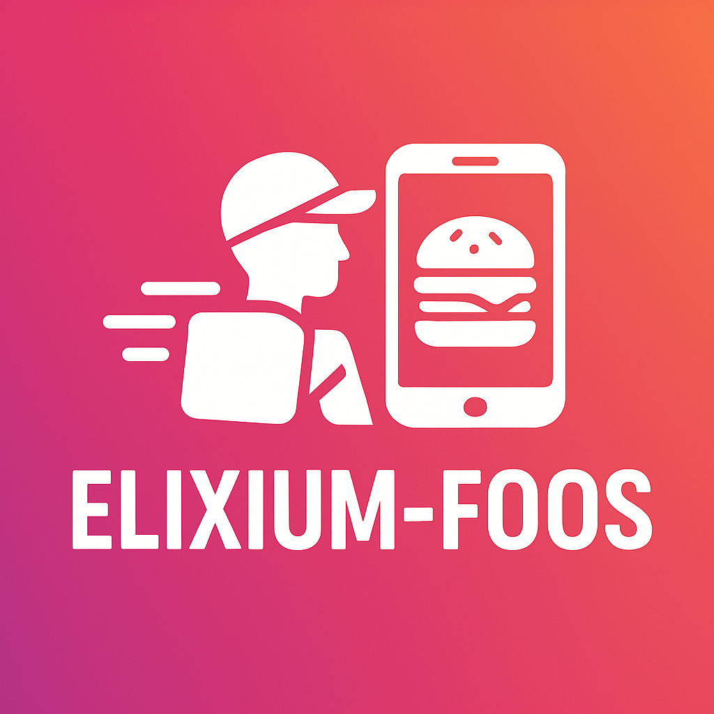
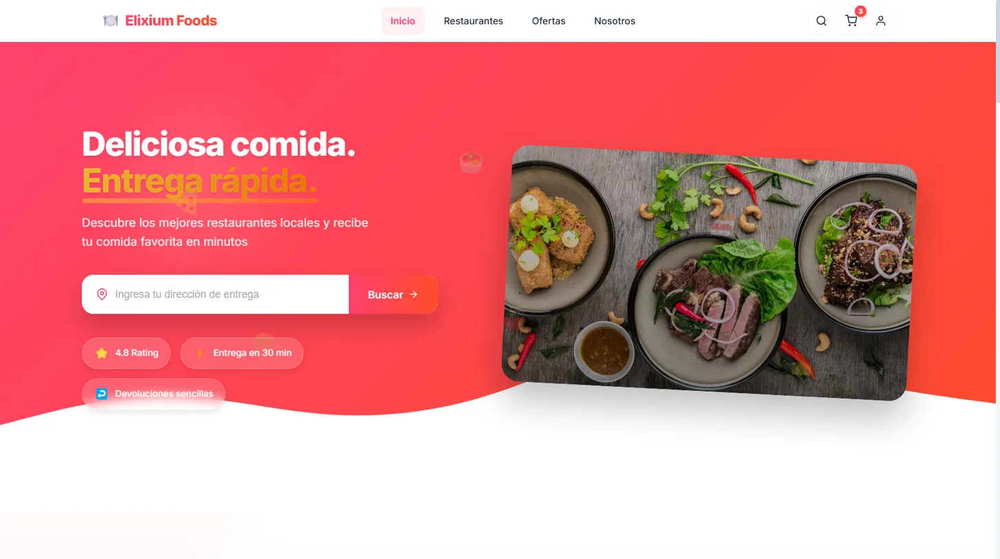
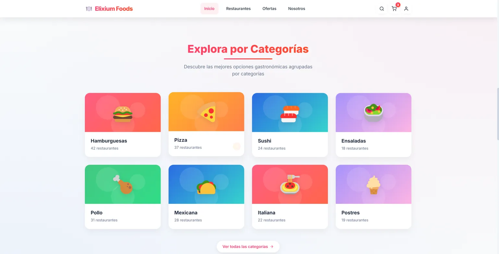
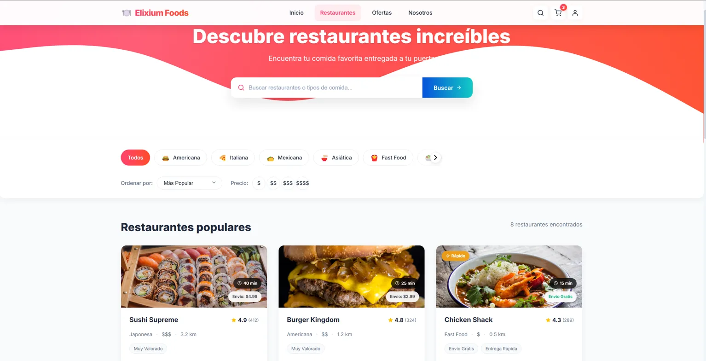

# 🍽️ Elixium Foods

<div align="center">



### **Deliciosa comida. Entrega rápida.**

[](https://vuejs.org/)
[](https://www.typescriptlang.org/)
[](https://tailwindcss.com/)
[](https://sass-lang.com/)
<br/>
[](https://dotnet.microsoft.com/)
[](https://www.postgresql.org/)
[](https://www.docker.com/)
[](https://aws.amazon.com/)

</div>

<p align="center">
  <a href="#-características-destacadas">Características</a> •
  <a href="#-capturas-de-pantalla">Capturas</a> •
  <a href="#-stack-tecnológico">Stack</a> •
  <a href="#-instalación-rápida">Instalación</a> •
  <a href="#-arquitectura">Arquitectura</a> •
  <a href="#-equipo">Equipo</a>
</p>

---

## 📱 Capturas de Pantalla

<div align="center">
<table>
  <tr>
    <td></td>
    <td></td>
    <td></td>
  </tr>
  <tr>
    <td align="center"><strong>Home</strong></td>
    <td align="center"><strong>Categorías</strong></td>
    <td align="center"><strong>Restaurantes</strong></td>
  </tr>
</table>
</div>

## ✨ Características Destacadas

- 🚀 **Diseño Mobile-First Explosivo**: Experiencia fluida en cualquier dispositivo con transiciones elegantes
  
- 🎨 **UI Premium y Cautivadora**: Esquema de color vibrante, componentes personalizados y microinteracciones sofisticadas

- 🔍 **Descubrimiento Intuitivo**: Sistema de exploración por categorías con tarjetas visualmente distintivas
  
- ⚡ **Entregas Ultra-rápidas**: Algoritmos de optimización de rutas para entregas garantizadas en 30 minutos o menos

- 🛒 **Checkout Simplificado**: Proceso de compra optimizado para maximizar conversiones

- 👤 **Personalización Avanzada**: Adapta cada aspecto de tu pedido según tus preferencias específicas

- 🔐 **Seguridad Inquebrantable**: Pasarela de pago con encriptación de extremo a extremo

- 📊 **Analíticas en Tiempo Real**: Seguimiento detallado de cada fase de tu pedido

- 🌟 **Sistema de Fidelización**: Recompensas exclusivas para clientes recurrentes

## 🛠️ Stack Tecnológico

Elixium Foods implementa una arquitectura moderna y escalable utilizando las tecnologías más potentes del mercado:

### Frontend
- **Vue.js 3**: Framework progresivo para interfaces de usuario con Composition API
- **TypeScript**: Tipado estático para un desarrollo más robusto y mantenible
- **Pinia**: Gestión de estado para Vue 3 con soporte completo para TypeScript
- **Vue Router**: Enrutamiento oficial para aplicaciones Vue.js
- **Tailwind CSS**: Framework de utilidades CSS para diseño rápido y consistente
- **SCSS con BEM**: Estilos personalizados con arquitectura mantenible

### Backend
- **ASP.NET Core**: Framework de alto rendimiento para APIs RESTful
- **Entity Framework Core**: ORM para acceso a datos eficiente y tipado
- **PostgreSQL**: Base de datos relacional robusta y escalable
- **Swagger**: Documentación API interactiva y fácil de usar

### DevOps & Infraestructura
- **Docker**: Contenedores para desarrollo y despliegue consistentes
- **GitHub Actions**: CI/CD automatizado con flujos de trabajo personalizables
- **Vitest**: Framework de testing rápido y nativo de Vue
- **AWS**: Infraestructura cloud para escalabilidad y fiabilidad

## 📋 Arquitectura

Elixium Foods implementa una arquitectura de servicios escalable con las siguientes características:

- **Separación Frontend-Backend**: API RESTful con comunicación stateless
- **Base de Datos Optimizada**: PostgreSQL con esquemas eficientes para alta demanda
- **Cache Distribuida**: Mejoras de rendimiento para consultas frecuentes
- **Seguridad por Diseño**: Implementación de mejores prácticas en cada capa de la aplicación

## 🚀 Instalación Rápida

### Requisitos Previos

- Node.js 16+ y npm/yarn
- Docker y Docker Compose
- .NET 6+

### Desarrollo Local

```bash
# 1. Clonar el repositorio
git clone https://github.com/your-username/elixium-foods.git
cd elixium-foods

# 2. Instalar dependencias frontend
npm install

# 3. Configurar variables de entorno
cp .env.example .env.local

# 4. Iniciar entorno de desarrollo completo (frontend + backend + db)
docker-compose up -d

# 5. ¡Listo! Accede a:
#    - Frontend: http://localhost:8080
#    - API Backend: http://localhost:5000
#    - Swagger UI: http://localhost:5000/swagger
```

### Estructura del Proyecto

```
elixium-foods/
├── src/                        # Código fuente frontend
│   ├── assets/                 # Recursos estáticos (imágenes, estilos)
│   │   └── styles/             # Archivos SCSS globales
│   ├── components/             # Componentes reutilizables
│   │   ├── common/             # Componentes de UI básicos
│   │   ├── feature/            # Componentes específicos de funcionalidad 
│   │   └── layout/             # Componentes de estructura página
│   ├── composables/            # Lógica reutilizable con Composition API
│   ├── constants/              # Valores constantes y configuración
│   ├── router/                 # Configuración de rutas
│   ├── services/               # Servicios para comunicación API
│   ├── store/                  # Estado global (Pinia)
│   ├── types/                  # Definiciones de tipos TypeScript
│   ├── utils/                  # Funciones utilitarias
│   └── views/                  # Componentes a nivel de página
├── server/                     # Backend ASP.NET Core
│   ├── Elixium.API/            # Proyecto principal API
│   ├── Elixium.Core/           # Lógica de negocio
│   ├── Elixium.Data/           # Acceso a datos y migraciones
│   └── Elixium.Tests/          # Pruebas de la API
└── ...
```

## 📊 Pipeline CI/CD

El proyecto utiliza GitHub Actions para implementar un pipeline de integración y despliegue continuo:

1. **Verificación de Código**:
   - Lint y formateo automático
   - Análisis estático y detección de vulnerabilidades
   - Pruebas unitarias con Vitest

2. **Construcción y Empaquetado**:
   - Compilación optimizada del frontend
   - Build de la API .NET
   - Generación de imágenes Docker

3. **Despliegue Progresivo**:
   - Entorno de desarrollo para pruebas funcionales
   - Entorno de producción con verificación de salud

## 🧪 Pruebas Automatizadas

```bash
# Ejecutar pruebas unitarias frontend
npm run test:unit

# Ejecutar pruebas unitarias backend
cd server
dotnet test
```

## 👥 Equipo

Desarrollado con ❤️ por un equipo de profesionales apasionados por la tecnología y la gastronomía.

## 📄 Licencia

Este proyecto está licenciado bajo [MIT License](LICENSE).

## 🙌 Contribuciones

¡Las contribuciones son bienvenidas! Revisa nuestras [guías de contribución](CONTRIBUTING.md) para comenzar.

## 🌟 Inspiración y Agradecimientos

- [Vue.js Team](https://vuejs.org/)
- [Tailwind Labs](https://tailwindcss.com/)
- [Microsoft .NET Team](https://dotnet.microsoft.com/)
- [PostgreSQL Team](https://www.postgresql.org/)
- Todos los colaboradores y early adopters que han hecho Elixium Foods posible

---

<div align="center">
  <p>Elixium Foods © 2023-2025 • Deliciosa comida. Entrega rápida.</p>
  
  <a href="https://twitter.com/"></a>
  <a href="https://instagram.com/"></a>
  <a href="https://linkedin.com/"></a>
</div>
